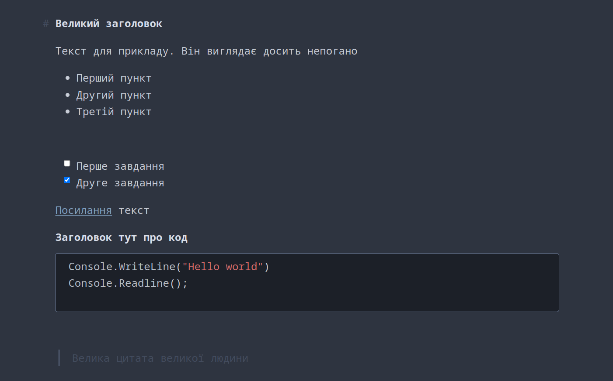

# IA Typora Nord

Theme for typora markdown text editor.

Only works with Linux. Not tested with Win/macOS.

## General

IA Typora Nord is a try to recreate the UI of the iconic IA Writer theme with the original font and nord theme support.

It is basically the IA Typora theme with some modifications.

## Installation

1. Download all files and fonts folder.
2. Open Theme Folder from `Preference Panel` → `Appearance` section.
   
3. Copy `ia_typora_nord.css`, into the newly opened folder.
4. Copy/Move all fonts in the `fonts` folder to your systems font folder
5. Restart typora, then select `IA Typora Nord` from `Themes` menu.
   
   > It's made with GNU/Linux, and is not tested on Windows or Mac.

## Required / License

Night theme needs to be installed. 

Copy/Move the delivered fonts into your local font directory. IA Writer Mono Font is based on IBM Plex Typeface. Check `license.md` for more infos. 

## Screenshot

